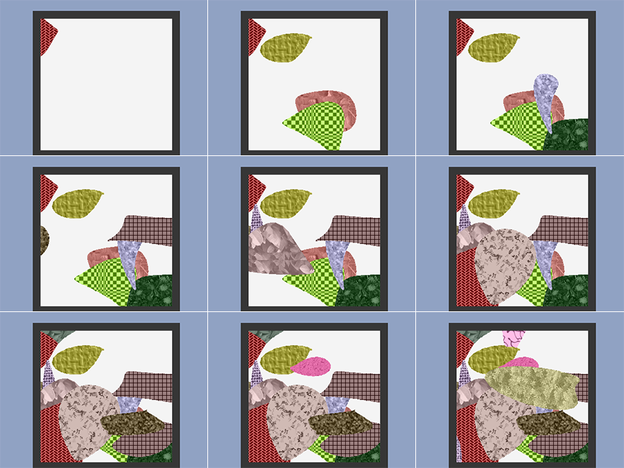
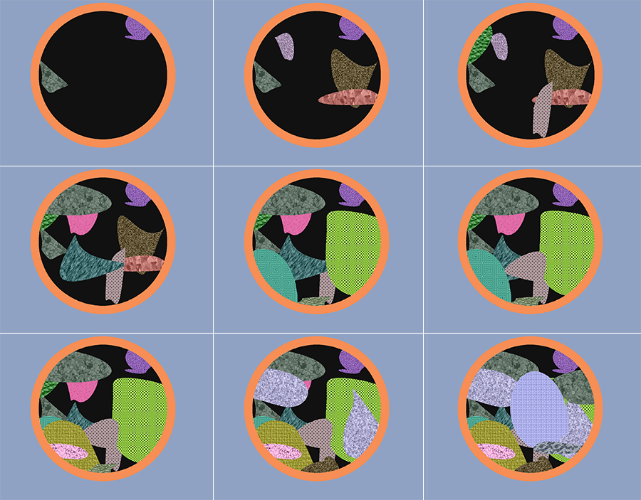

# Trash Generator
Generates randomized toy examples of food waste 🗑.

As a stop-gap measure so that we can work on development even before any real data has arrived, we have decided to make a trash generation program.
The goal is to randomly generate images of trash cans with food waste in them, along with the required annotations.
The images themselves will be very simple, consisting mostly of solid colors and lines as well as simple patterns representing different foodstuff.

This generates an arbitrary number of image sequences, with each image sequence having arbitrary length as defined by the user or chosen randomly.

## Running the generator
The generator can be run from the command line.

```bash
python3 dataset_generator.py DIR N [LENGTH] [-a val]
```

- `DIR` is the where the dataset should be output to. It must be empty.
- `N` is the number of image sequences to generate.
- `LENGTH` is the length of each image sequence. If none is given, then a random length between 0 and 50 will be chosen
- `-a` is the absolute flag. If the flag is set, then the dataset will be cut to `val` images.
  e.g. if `val` is 20, `N` is 6, and `LENGTH` is 8, then the 3rd image sequence will only have 4 images. 
 
## Annotation Schema
This dataset uses a custom annotation style.

### Directory Structure Example
```
dataset/
├── annotations.json
│
├── images/
│   ├── 2020-09-18-10-34-29.jpg
│   ...
│   └── 2020-12-21-13-32-32.jpg
│
├── new_object_masks/
│   ├── 2020-09-18-10-34-29.png
│   ...
│   └── 2020-12-21-13-32-32.png
│
└── top_20_masks/
    ├── 2020-09-18-10-34-29_.png
    ...
    └── 2020-12-21-13-32-32.png
```

### `annotations.json` Example
```json
{
  "images": 
  {
    "2019-09-18-10-34-29.jpg": 
    {
      "new_obj_mask": "new_object_masks/2020-09-18-10-34-29.png",
      "top_20_mask": "top_20_masks/2020-09-18-10-34-29.png",
      "prev_image": null,
      "next_image": "2019-09-18-10-34-43.jpg",
      "categories": 
      {
        "1": {"super_category": "fruit", "category": "banana", "avoidable": false}
      }
    }
  }
}
```

The category keys here corresponds with the luminosity value in the corresponding 8-bit top_20 segmentation mask. 


## Examples
Here are some examples of the results of this tool for image sequences of length 9



