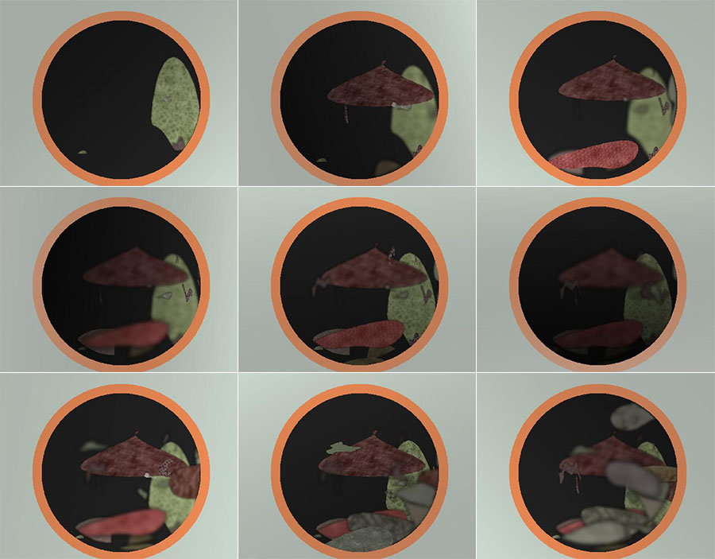
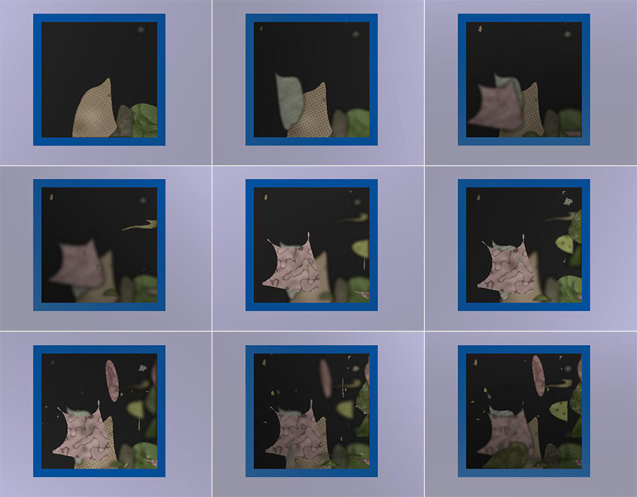
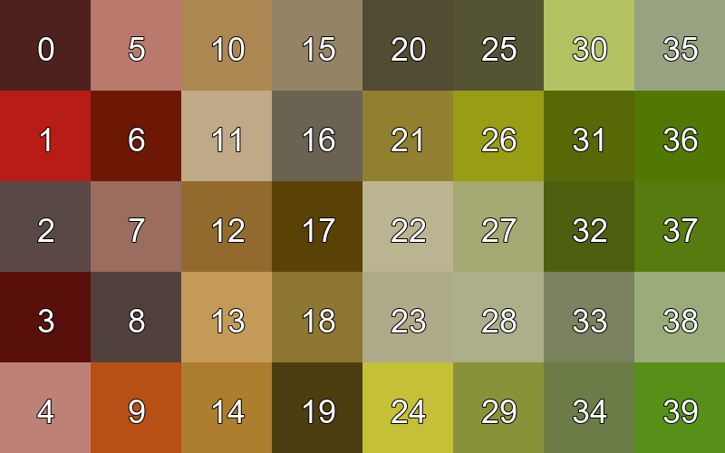

# Trash Generator

Generates randomized toy examples of food waste 🗑.

As a temporary measure so that we can work on development even before any real data has arrived, we have decided to make a trash generation program.
The goal is to randomly generate images of trash cans with food waste in them, along with the required annotations.
The images themselves will be relatively simple, consisting mostly of patterns and lines representing different foodstuff.

This generates an arbitrary number of image sequences, with each image sequence having arbitrary length as defined by the user or chosen randomly.

## Running the generator

The generator can be run from the command line.

```bash
python3 dataset_generator.py DIR CSV N [LENGTH] [--height val] [--width val]
```

- `DIR` is the where the dataset should be output to. If it is not empty, its contents will be overwritten.
- `CSV` is the classes csv file. A default version is included in this repo under `src/classes.csv`.
- `N` is the number of image sequences to generate.
- `LENGTH` is the length of each image sequence. If none is given, then a random length between 0 and 50 will be chosen
  e.g. if `val` is 20, `N` is 6, and `LENGTH` is 8, then the 3rd image sequence will only have 4 images. 
- `--height` is an optional height argument. This specifies the height of the generated image. Defaults to 800. 
- `--width` is an optional width argument. This specifies the width of the generated image. Defaults to 1024.

## Requirements

- numpy~=1.18
- Pillow==7.0
- scipy==1.4.1
- scikit-image~=0.16
- tqdm

These requirements can be met/installed most easily by using pip.

```bash
pip install -r requirements.txt 
```

## Annotation Schema

This dataset uses a custom annotation style.

### Directory Structure Example

```plaintext
dataset/
├── annotations.json
│
├── images/
│   ├── 2020-09-18-10-34-29.jpg
│   ...
│   └── 2020-12-21-13-32-32.jpg
│
├── new_object_masks/
│   ├── 2020-09-18-10-34-29.png
│   ...
│   └── 2020-12-21-13-32-32.png
│
└── top_20_masks/
    ├── 2020-09-18-10-34-29_.png
    ...
    └── 2020-12-21-13-32-32.png
```

### `annotations.json` Example

```json
{
  "categories": 
  {
    "1": {"super_category": "fruit", "category": "banana", "avoidable": false}
  },
  "images": 
  {
    "2019-09-18-10-34-29.jpg": 
    {
      "new_obj_mask": "new_object_masks/2020-09-18-10-34-29.png",
      "top_20_mask": "top_20_masks/2020-09-18-10-34-29.png",
      "prev_image": null,
      "next_image": "2019-09-18-10-34-43.jpg"
    }
  }
}
```

The category keys here corresponds with the luminosity value in the corresponding 8-bit top_20 segmentation mask. 


## Examples

Here are some examples of the results of this tool for image sequences of length 9




## Color scheme
A hand-picked color scheme was chosen for the color of the objects inside the bin to make them have colors that are more analogous to items that may be found in trash bins.
For example, the colors are more muted and more similar to each other.
The final chosen color scheme uses the following colors.



The color scheme was generated using the the script `trash_generator/color_generator.py`. 

## Classes CSV file

The file `classes.csv` is used to specify properties of each class that is generated.

| Attribute        | Description                                                                                                                                                                                                                                                                                                                                                         |
|------------------|---------------------------------------------------------------------------------------------------------------------------------------------------------------------------------------------------------------------------------------------------------------------------------------------------------------------------------------------------------------------|
| `super_category` | Super category of the trash item to be generated. This is arbitrary and can be any value. An example is "fruit"                                                                                                                                                                                                                                                     |
| `category`       | The actual category of the item. An example for the `super_category` "fruit" would be "banana".                                                                                                                                                                                                                                                                     |
| `avoidable`      | Whether or not the waste was avoidable. This does not have an impact on the bin image generation, but its value is stored in the categories section of the annotation file.                                                                                                                                                                                         |
| `color`          | Takes a value in the range [0, 39]. The color is then taken from the file `colors.csv`. The available colors are visualized below with their index values superimposed on the palette                                                                                                                                                                               |
| `shape`          | Takes a value in ("semicircle", "ellipse", "banana", ""). This is the base shape that is generated. If "" is chosen, i.e. nothing is put in this field, then a pseudo-random shape is generated. Note that deform attributes can only be applied to classes which have a given shape, as deforming an already random shape is non-productive.                       |
| `p_warp_deform`  | Takes a value in the range [0, 1]. The probability that a warp deformation is applied. A warp deformation are two sine waves with random amplitude and wavelength applied on the x and y axes respectively, being added to each x, y coordinate on the perimeter of the shape.                                                                                      |
| `p_slice_deform` | Takes a value in the range [0, 1]. The probability that the shape will be sliced at a random angle and position.                                                                                                                                                                                                                                                    |
| `max_items`      | Takes an integer value greater than 0. The number of items to generate for each instance of this class. A random value in the range [1, max_items] of items is then generated, and each item scaled down proportionally to the number of items generated. Useful for objects such as french fries, where there may be many small items in one instance of the item. |
 
## To Future Users and Contributors

In case you need to modify code or understand how it works, here's the flow of the code.

1. `dataset_generator.py` is run. Inside this file, the function `generate_dataset()` is called.
2. `generate_dataset()` figures out the required parameters of the dataset to be generated.
3. `generate_dataset()` then creates a `BinSequence` instance, which can be found in `trash_generator/bin_sequence.py`.
4. `BinSequence` first generates a random rubbish bin image in its `_randomize_bin()` method, which calls the `generate_bin()` function in the file `trash_generator/bin_generator.py`.
5. `BinSequence` also creates a `TrashGenerator` instance, which creates the random shapes necessary to fill the bin with.
6. `TrashGenerator` is a class that can be found in `trash_generator/trash_gen.py`.
7. `TrashGenerator` uses the `classes.csv` file to figure out what each class should be shaped like and how they behave.
8. `BinSequence` also determines the colors for the classes. They are hard-coded as hex strings with the variable name `self.class_colors`.
    1. The color of the bin, its inside, and the background are randomly selected by a possible range of colors in `BinGenerator`'s `_choose_colors()` method.
9. Once the initialization is completed, `generate_dataset()` calls the `generate_sequence()` method of `BinSequence`, which generates a sequence of images and their corresponding ground truths.
   The actual trash sequence is rendered by the `_render()` method, which also adds various noise into the image.
10. Finally, `generate_dataset()` receives the generated images and generates the actual annotation and file structure required. 

### Repository structure

```plaintext
trash-generator/
├── media/
│   └── ...                   # Media files used for the readme
│
└── src/                      # Sources root
    ├── patterns/
    │   └── ...               # Raw pattern files in .png format
    ├── trash_generator/
    │   ├── __init__.py       # Init file for the trash_generator package
    │   ├── bin_generator.py  # generate_bin() function which generates an empty bin with background
    │   ├── bin_sequence.py   # BinSequence class which actually creates the sequence of images
    │   └── trash_gen.py      # Generates the trash contents of the bin
    │
    ├── utils/                # Miscellaneous utilities
    │   ├── __init__.py       # Init file for the utils package.
    │   └── color_utils.py    # Contains utils to generate the color scheme and work with the colors.
    │
    ├── classes.csv           # Class attributes file
    ├── colors.csv            # Color specifications file
    └── dataset_generator.py  # The file that should be run. generate_dataset() is in here.
                              # Takes a BinSequence object and processes it into the appropriate format. 
```